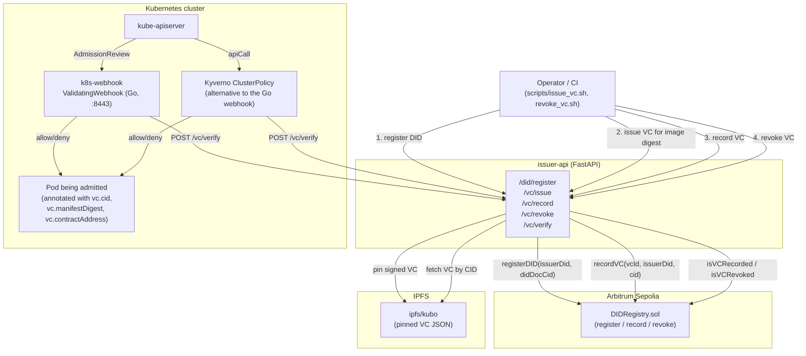

# DID + VC Contract-Bound Container Image PoC

A proof-of-concept that binds a container image's OCI manifest digest to an
issuing smart contract address inside a **Verifiable Credential (VC)**, so a
Kubernetes admission controller can refuse to run an image unless a valid,
non-revoked credential vouches for exactly that `(digest, contract)` pair.

## DID / VC mechanism

- **Identity**: the issuer holds a single `did:web:<domain>` identity backed by
  an Ed25519 keypair generated at runtime (`issuer-api/did_utils.py`). This is
  a minimal, demo-grade DID method — no DID document resolution, no key
  rotation ceremony, just a domain-scoped identifier plus a public key.
- **Credential**: a VC is a JSON payload (`issuer`, `issuedAt`, `expiration`,
  and a `credentialSubject` containing the OCI `manifestDigest` and the
  `contractAddress` that is authoritative for that image) signed with the
  issuer's Ed25519 key (`issuer-api/vc_utils.py`). The VC's id is the SHA-256
  hash of its canonical JSON payload.
- **Storage**: the signed VC (payload + proof) is pinned to IPFS
  (`issuer-api/ipfs_utils.py`) and referenced everywhere else by its CID.
- **Anchoring / revocation**: the VC id, issuer DID, and IPFS CID are recorded
  on-chain in `DIDRegistry.sol` (Arbitrum Sepolia). Recording is idempotent
  (`already recorded` guard) and revocation is one-way
  (`already revoked` guard), so the contract is the source of truth for
  "is this VC still good", not IPFS or the API's memory.
- **Verification**: `POST /vc/verify` fetches the VC from IPFS, checks the
  Ed25519 signature, checks that the manifest digest and contract address in
  the credential match what the caller is asking about, and then checks
  on-chain recorded/revoked state (cached for 5 minutes via `cachetools`).
  A result is only `valid` if the signature checks out, the fields match, the
  VC is recorded, and it has not been revoked.
- **Enforcement**: a Kubernetes `ValidatingWebhook` (`k8s-webhook/main.go`)
  reads `vc.cid` / `vc.manifestDigest` / `vc.contractAddress` annotations off
  a `Pod` and calls `/vc/verify`; the pod is only admitted if the response
  says `valid: true`. A Kyverno `ClusterPolicy` (`kyverno/vc-verify-policy.yaml`)
  implements the same check declaratively, as an alternative to running the
  Go webhook.

## Repository layout

| Path | What it is |
|---|---|
| `contracts-hardhat/` | `DIDRegistry.sol` + Hardhat project to deploy/test it |
| `issuer-api/` | FastAPI service: DID registration, VC issue/record/revoke/verify, Prometheus metrics |
| `k8s-webhook/` | Go `ValidatingWebhook` admission server that calls `issuer-api`'s `/vc/verify` |
| `charts/vc-webhook/` | Helm chart for deploying the Go webhook |
| `kyverno/` | Kyverno `ClusterPolicy` alternative to the Go webhook |
| `scripts/` | Demo helper scripts (issue/record/revoke a VC, build a demo image, replay-attack demo) |

## Architecture



## Prerequisites

- Docker and Docker Compose (v2 `docker compose`)
- Node.js 22+ (only needed to deploy/redeploy the contract)
- An Arbitrum Sepolia RPC endpoint and a funded deployer private key
- `jq` (used by the demo scripts)

## 1) Deploy the contract

```bash
cd contracts-hardhat
cp .env.example .env   # fill ARBITRUM_SEPOLIA_RPC and DEPLOYER_PK
npm install
npm run build
npm run deploy:arb
# note the printed address, export it as CONTRACT_ADDRESS in your shell
```

## 2) Run IPFS + the issuer API with Docker Compose

```bash
cp issuer-api/.env.example issuer-api/.env
# edit issuer-api/.env: RPC_URL, CONTRACT_ADDRESS, DEPLOYER_PK, ISSUER_API_KEY
docker compose up -d --build
```

This starts two containers:

- `didauth-ipfs` — `ipfs/kubo`, HTTP API on `localhost:5001`, gateway on `localhost:8081`
- `didauth-issuer-api` — the FastAPI service, built from `issuer-api/Dockerfile`
  (Python 3.13-slim, multi-stage build, runs as a non-root user), listening on
  `localhost:8080`, pointed at the `ipfs` service on the compose network

To run the API directly on the host instead (e.g. for local development):

```bash
cd issuer-api
python3 -m venv .venv && source .venv/bin/activate
pip install -r requirements.txt
uvicorn app:app --reload --port 8080
```

## 3) Build a demo image & get its OCI digest

```bash
./scripts/build_demo_image.sh
DIGEST=$(./scripts/extract_digest.sh local/demo:latest)
export CONTRACT_ADDRESS=0x<your-deployed-registry>
export ISSUER_API_KEY=supersecret
```

## 4) Issue + record a VC

```bash
./scripts/issue_vc.sh "$DIGEST"
# writes vc_issue.json with vc_id and ipfs_cid
```

## 5) Verify and revoke

```bash
CID=$(jq -r .ipfs_cid vc_issue.json)
curl -s -X POST http://127.0.0.1:8080/vc/verify -H "Content-Type: application/json" \
  -d "{\"manifest_digest\":\"$DIGEST\",\"contract_address\":\"$CONTRACT_ADDRESS\",\"vc_cid\":\"$CID\"}" | jq .

VCID=$(jq -r .vc_id vc_issue.json)
./scripts/revoke_vc.sh "$VCID"

curl -s -X POST http://127.0.0.1:8080/vc/verify -H "Content-Type: application/json" \
  -d "{\"manifest_digest\":\"$DIGEST\",\"contract_address\":\"$CONTRACT_ADDRESS\",\"vc_cid\":\"$CID\"}" | jq .
```

## 6) Deploy the admission webhook (optional, requires a Kubernetes cluster)

```bash
docker build -t <registry>/vc-webhook:latest ./k8s-webhook
docker push <registry>/vc-webhook:latest
# create the vc-webhook-tls secret (see k8s-webhook/manifests/tls-bootstrap.yaml
# for the CSR bootstrap flow), then:
helm install vc-webhook charts/vc-webhook \
  --set image.repository=<registry>/vc-webhook \
  --set verifierURL=http://issuer-api.default.svc:8080/vc/verify
```

Or apply `kyverno/vc-verify-policy.yaml` instead if you'd rather enforce this
with Kyverno than run the Go webhook.

## Metrics

`issuer-api` exposes Prometheus metrics at `GET /metrics`:
`vc_verify_requests_total`, `vc_verify_failures_total`,
`vc_verify_duration_seconds`, `vc_verify_cache_hits_total`.

## Notes / limitations

- This is a PoC. The `did:web`-style identity and Ed25519 signing scheme are
  minimal by design — swap in your production DID method and key management
  (a `KMSSigner` stub exists in `issuer-api/signer.py` for that purpose).
- IPFS responses are trusted as-is by CID; CID tampering breaks integrity by
  construction, but there is no additional pinning/availability guarantee
  beyond whatever your `ipfs/kubo` node provides.
- `web3.py` was deliberately kept on the 6.x line (bumped to the latest 6.20.x
  patch) rather than jumped to 7.x, since the on-chain code paths
  (`chain_utils.py`) could not be exercised against a live RPC endpoint in this
  environment and 7.x renames several attributes used here.
