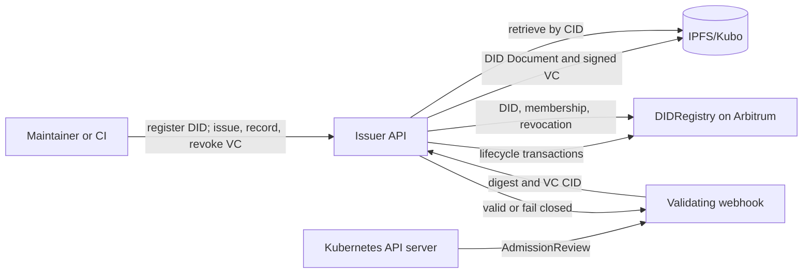

# CBC-Provenance

Contract-bound Verifiable Credentials for replay-resistant OCI image
provenance in Kubernetes.

CBC-Provenance binds an immutable OCI manifest digest to an
operator-controlled Contract-Binding Context:

```text
CBC = (chainId, contractAddress)
```

The binding is inside a signed W3C Verifiable Credential. A Kubernetes
admission request succeeds only when the image digest and CBC match, the
Ed25519 proof resolves to the issuer's on-chain-bound DID Document, the VC is
within its validity window, and its canonical identifier is recorded and not
revoked on-chain.

## Security properties

- **Cross-context replay resistance:** a VC issued for one chain and contract
  cannot be accepted by a verifier configured for another CBC.
- **Artifact integrity:** every admitted image is referenced by an immutable
  `name@sha256:<digest>` value and checked against the signed VC.
- **Issuer authenticity:** the verifier binds the Ed25519 verification key to
  the DID Document CID registered on-chain.
- **Lifecycle enforcement:** unrecorded, expired, not-yet-valid, and revoked
  VCs fail admission.
- **Fail-closed operation:** verifier errors, dependency timeouts, malformed
  images, missing credentials, and webhook unavailability deny admission.
- **Bounded revocation freshness:** the default 30-second cache gives the
  manuscript bound `Δ = t_finality + TTL_cache + ε_network`.

`chainId` and `contractAddress` are derived from the issuer/verifier's RPC and
deployment configuration. They are never trusted from Pod annotations or an
untrusted verification request.

## Architecture



| Component | Responsibility |
|---|---|
| `contracts-hardhat/` | Per-DID ownership/delegation, DID Document anchoring, batch VC recording, status, and revocation |
| `issuer-api/` | `did:key` lifecycle, URDNA2015 canonicalization, Ed25519Signature2020 proof, IPFS, Web3, verification, metrics |
| `k8s-webhook/` | TLS 1.3 admission endpoint; verifies every init, application, and ephemeral container |
| `charts/vc-webhook/` | Fail-closed, two-replica Helm deployment |
| `kyverno/` | Digest-pinning policy complementing cryptographic webhook enforcement |
| `scripts/` | Issuance, recording, revocation, digest extraction, replay, and load utilities |

## Credential profile

VCs follow the W3C VC Data Model v1.1 shape and use `did:key` with Ed25519:

```json
{
  "@context": ["https://www.w3.org/2018/credentials/v1"],
  "type": ["VerifiableCredential", "ContainerImageCredential"],
  "issuer": "did:key:z...",
  "credentialSubject": {
    "image": {
      "manifestDigest": "sha256:...",
      "reference": "registry.example/app@sha256:..."
    },
    "cbc": {
      "chainId": 421614,
      "contractAddress": "0x..."
    },
    "didDocCid": "bafy..."
  },
  "issuanceDate": "2026-08-21T00:00:00Z",
  "expirationDate": "2026-11-19T00:00:00Z",
  "proof": {
    "type": "Ed25519Signature2020",
    "verificationMethod": "did:key:z...#key-1",
    "proofPurpose": "assertionMethod",
    "proofValue": "z..."
  }
}
```

The stable VC identifier is
`keccak256(URDNA2015(VC_without_proof))`. The proof covers the canonicalized VC
and deterministic proof options. Remote JSON-LD context retrieval is disabled;
the supported VC context is resolved locally to avoid network-dependent
canonicalization.

## Quick start

### 1. Deploy the registry

```bash
cd contracts-hardhat
cp .env.example .env
npm install
npm run build
npm run deploy:arb
```

Configure `ARBITRUM_SEPOLIA_RPC` and `DEPLOYER_PK` before deployment. Record the
deployed address.

### 2. Configure the issuer

```bash
cp issuer-api/.env.example issuer-api/.env
```

Set at least:

```dotenv
RPC_URL=https://your-arbitrum-sepolia-rpc
CONTRACT_ADDRESS=0xYourDeployedRegistry
DEPLOYER_PK=0xYourAuthorizedDIDControllerKey
ISSUER_API_KEY=replace-this-value
IPFS_API=http://ipfs:5001/api/v0
```

The API key protects lifecycle writes. Use mTLS or an authenticated private
network in production and configure the encrypted key file variables in the
example environment.

### 3. Start IPFS and the API

```bash
docker compose up -d --build
curl --fail http://127.0.0.1:8080/health
```

### 4. Issue and record a credential

```bash
DIGEST=$(./scripts/extract_digest.sh registry.example/app:release)
./scripts/issue_vc.sh "$DIGEST"
```

The script registers the issuer DID, issues and pins the VC, then records its
canonical identifier on-chain. Separate record and revoke utilities are also
provided.

### 5. Annotate a digest-pinned workload

For a Pod with one image:

```yaml
metadata:
  annotations:
    cbc.provenance/vc: bafyYourCredentialCid
spec:
  containers:
    - name: app
      image: registry.example/app@sha256:0123456789abcdef0123456789abcdef0123456789abcdef0123456789abcdef
```

For multiple images, use one annotation per container name:

```yaml
cbc.provenance/vc-app: bafyAppCredential
cbc.provenance/vc-sidecar: bafySidecarCredential
```

This convention applies to init and ephemeral containers as well.

### 6. Install admission enforcement

```bash
helm install vc-webhook charts/vc-webhook \
  --set image.repository=registry.example/cbc-provenance-webhook \
  --set verifierURL=http://issuer-api.default.svc:8080/vc/verify \
  --set caBundle='<base64-encoded-CA-bundle>'

kubectl apply -f kyverno/vc-verify-policy.yaml
```

Provision the TLS secret using
`k8s-webhook/manifests/tls-bootstrap.yaml` or your certificate manager.

## API

| Endpoint | Authentication | Purpose |
|---|---|---|
| `POST /did/register` | API key | Generate and register a `did:key` DID Document |
| `POST /vc/issue` | API key | Issue, sign, and pin a contract-bound VC |
| `POST /vc/record` | API key | Record a VC identifier and CID on-chain |
| `POST /vc/revoke` | API key | Revoke a recorded VC |
| `POST /apikey/rotate` | API key | Rotate the encrypted lifecycle API key |
| `POST /vc/verify` | cluster-internal | Verify digest, CBC, proof, DID binding, time, and status |
| `GET /health` | none | Liveness/readiness response |
| `GET /metrics` | deployment policy | Prometheus metrics |

## Operational parameters

| Parameter | Default | Manuscript role |
|---|---:|---|
| `CLOCK_SKEW_SECS` | 5 | Timestamp tolerance `δ` |
| `REVOCATION_CACHE_TTL_SECS` | 30 | TTL component of revocation bound `Δ` |
| `EXTERNAL_REQUEST_TIMEOUT_SECS` | 5 | Fail-closed IPFS timeout |
| Webhook verifier timeout | 5 s | Fail-closed admission dependency timeout |
| Webhook replicas | 2 | Minimum production posture |

## Threat model and limitations

The project addresses image tampering, cross-context replay, credential
forgery, stale revocation, metadata leakage, downgrade policy, and admission
TOCTOU as described in [`docs/THREAT_MODEL.md`](docs/THREAT_MODEL.md).

Maintainer-key compromise, a compromised verifier binary, total Kubernetes
control-plane compromise, build-system compromise, and sustained IPFS/RPC
unavailability remain outside the cryptographic guarantee. KMS/HSM signing is
represented by an interface but requires a provider-specific implementation.
IPFS provides content integrity, while availability still requires redundant
pinning and gateways.

Performance and gas figures in the manuscript describe its reported Arbitrum
Sepolia and Kubernetes experiments; they are not regenerated automatically by
this repository and should not be presented as measurements of another
environment without rerunning the published methodology.

## Development checks

```bash
cd contracts-hardhat && npm test
cd ../issuer-api && pytest
cd ../k8s-webhook && go test ./...
```

CI compiles and tests the contract, builds the webhook and API container, and
publishes the webhook image. Contract deployment is manual through the
workflow dispatcher because it changes external blockchain state.
